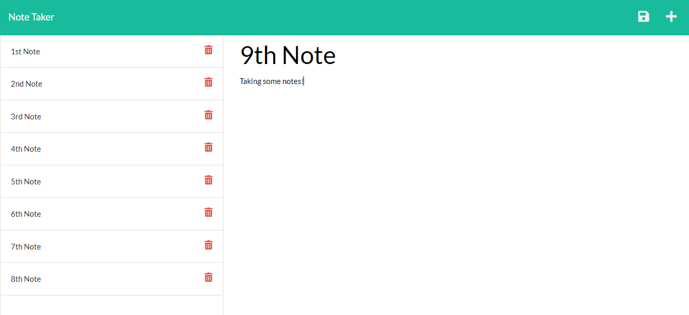

# make-dat-notes


## Table of Content

- [Description](#description)
- [Deployment](#deployment)
  - [Dependencies](#dependencies)
  - [Demo](#demo)
  - [Download Zip](#download-zip)
  - [Clone](#clone)
- [Contributors](#Contributors)
- [License](#License)
- [Outro](#Outro)

## Description
You need a way to make notes! Here is the one stop shop!!!!



### Dependencies
- [NPM](https://www.npmjs.com/)
- [NodeJS](https://nodejs.org/)
### Demo
You can access a live video link version at (insert link here)

### Download Zip
1. Go to the repo on (https://github.com/K-Bugz/make-dat-notes).
2. Click the green code button
   (./assets/images/green_code_button_github.png)
### Clone
1. Head to the (https://github.com/K-Bugz/make-dat-notes)
2. Click the green code.
   (./assets/images/green_code_button_github.png)
3. Click the copy button or just highlight and copy the HTTPS url.
   (./assets/images/copy_clone_url_github.png)
4. Go to Terminal apply the following command
```bash
git clone https://github.com/K-Bugz/make-dat-notes.git
```
## Contributors
- [Kevin Bugusky](https://github.com/K-Bugz)

## License
[MIT](./LICENSE)

## Outro
Thank you for stopping here and taking a look at my project. 